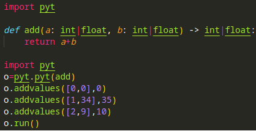
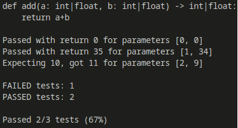

## Pyt
### What is pyt?
- a very easy python testing framework
- very minimal. find a bug? you can probably fix it!
- designed to be, pretty much, import and go!
- makes writing tests easier - and you re more likely to write them!
### Installation
- `git clone` this repo
- `cd src`
- `pip install .` in the directory
- and you're away!
- now it just works with import pyt.
### A quick example
- Also in test.py!
- Say we must test this function:
```py
def add(a: int|float, b: int|float) -> int|float:
    return a+b
```
- and we wanted to test these conditions:
```py
0+0==0
1+34==35
2+9==10
```
- we could add them with these statements
```py
import pyt
o=pyt.pyt(add) # create instance of pyt on function add
o.addvalues([0,0],0) # list of parameters, expected return value
o.addvalues([1,34],35) 
o.addvalues([2,9],10)
o.run() # run the tests, and produce a nice human readable output 
"""
Don't want pretty summing-up?
Just run o.run(human_readable=False)!
"""
```

- test.py:

- output:

### Anything else?
- Pyt has an `__eq__` method, an `__str__` and `__repr__`
